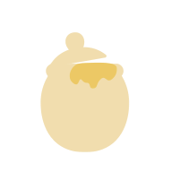

<!-- TODO アイコン作る -->

# SweetEngine
シンプルなC++2Dゲームエンジン。  
※開発中です。

## 特徴
* 簡単にゲームを構築できる
* めんどくさいSDLでの処理を簡単に記述できる
* ModernC++で記述できる

## Features
* コントローラーのサポート
* マウスのサポート
* タッチのサポート
* アトラステクスチャのサポート

## 技術
* C++ 23
* CMake
* SDL2
* SDL2_image
* SDL2_ttf

## 目次
- [チュートリアル](./doc/tutorial "チュートリアル")
    - [Windowの表示](./doc/tutorial/open_window.md "Windowの表示")
    - [ゲームループ](./doc/tutorial/game_loop.md "ゲームループ")
