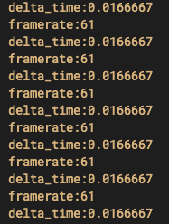

# ゲームループ

[READMEに戻る](../../README.md "READMEに戻る")

ゲームループクラスは、デルタタイムの計算、FPSの計算、FPSの制限をするクラスです。
使い方はとっても簡単で、update関数内で更新するだけでそれらの機能を使うことができます。
```cpp
#include <iostream>

#include <SDL.h>
#include <application.h>
#include <application_loop_info.h>
#include <game_loop.h>

sweet::GameLoop game_loop = {};

void update(sweet::Application &app) {
    game_loop.update();

    // デルタタイムの取得
    std::cout << "delta_time:" << game_loop.get_delta_time() << '\n';

    // フレームレートの取得
    std::cout << "framerate:" << static_cast<int>(game_loop.get_framerate()) << '\n';
}

int main(int, char**) {
    sweet::Application app {
        "sweet-engine window",
        {SDL_WINDOWPOS_CENTERED, SDL_WINDOWPOS_CENTERED},
        {1280, 720}
    };

    sweet::ApplicationLoopInfo info {
        .on_update = update
    };

    // 最大フレームレートを60FPSに設定
    game_loop.set_max_framerate(60.0f);

    app.running(info);

    return 0;
}
```


もしフレームレートを無制限にしたい場合は、最大フレームレートを-1にすることで実現できます。