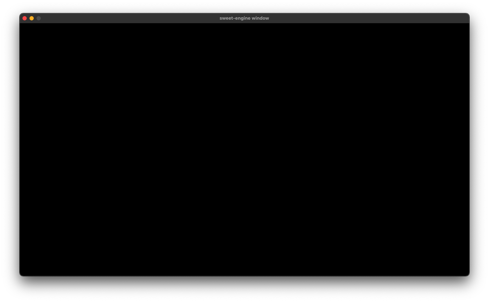

# Windowの表示

[READMEに戻る](../../README.md "READMEに戻る")

Windowの表示はSDLより簡単で、Applicationを初期化しrunningメソッドを呼び出すだけでWindowが表示されます。
```cpp
#include <SDL.h>
#include <application.h>
#include <application_loop_info.h>

int main(int, char**) {
    sweet::Application app {
        "sweet-engine window",
        {SDL_WINDOWPOS_CENTERED, SDL_WINDOWPOS_CENTERED},
        {1280, 720}
    };

    sweet::ApplicationLoopInfo info {};

    app.running(info);

    return 0;
}
```



また、WindowFlags、RenderFlags、GraphicsDriverIndexを指定したい場合は、Applicationクラスの第3引数以降に記述します。

```cpp
uint32_t window_flags = SDL_WINDOW_SHOWN;
uint32_t renderer_flags = SDL_RENDERER_VSYNC;
int32_t graphics_driver_index = -1;

sweet::Application app {
    "sweet-engine window",
    {SDL_WINDOWPOS_CENTERED, SDL_WINDOWPOS_CENTERED},
    {1280, 720},
    window_flags,
    renderer_flags,
    graphics_driver_index
};
```
# ループ
初期化や更新、レンダリングは全てApplicationLoopInfoに関数を登録して行います。
```cpp
#include <SDL.h>
#include <application.h>
#include <application_loop_info.h>

void initing(sweet::Application &app) {
    // SDL初期化前に呼ばれる
}

void inited(sweet::Application &app) {
    // SDL初期化後に呼ばれる
}

void update(sweet::Application &app) {
    // SDL_PollEvent前に呼ばれる
}

void render(sweet::Application &app) {
    // SDL_RenderClear後に呼ばれる
}

void event(sweet::Application &app, SDL_Event &e) {
    // イベント発生時に呼ばれる
}

void finishing(sweet::Application &app) {
    // 終了処理前に呼ばれる
}

void finished(sweet::Application &app) {
    // 終了処理後に呼ばれる
}

int main(int, char**) {
    sweet::Application app {
        "sweet-engine window",
        {SDL_WINDOWPOS_CENTERED, SDL_WINDOWPOS_CENTERED},
        {1280, 720}
    };

    sweet::ApplicationLoopInfo info {
        .on_initing = initing,
        .on_inited = inited,
        .on_update = update,
        .on_render = render,
        .on_event = event,
        .on_finishing = finishing,
        .on_finished = finished
    };

    app.running(info);

    return 0;
}
```
それぞれの関数の実行順序は以下の通りになっています。

1. on_initing (一回のみ)
2. on_inited (一回のみ)
3. on_update
4. on_event
5. on_render
6. on_finishing (一回のみ)
7. on_finished (一回のみ)