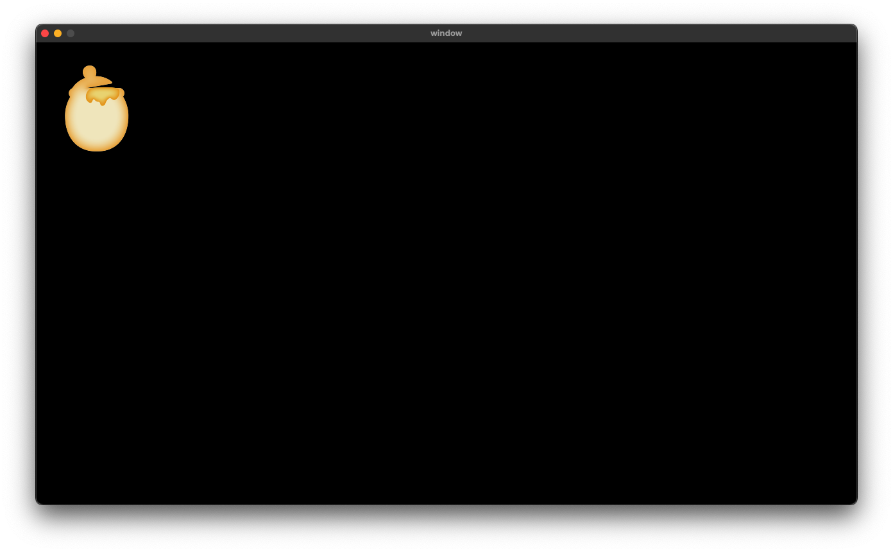
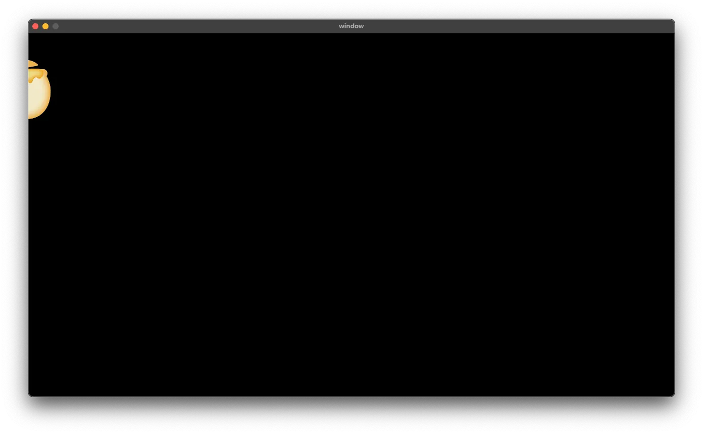

# Spriteの描画

[READMEに戻る](../../README.md "READMEに戻る")

画像を描画したい際にはSpriteクラスを使います。  
Spriteクラスを初期化する際には、レンダラーと描画したい画像のパスを指定します。  
初期化する際は必ず、**inited以降に呼ばれる関数で初期化**してください。  
initedよりも前に呼ばれる関数ではSDL_imageが初期化されていない状態なので、画像の読み込みに**失敗**する可能性があります。
```cpp
#include <sprite.h>

sweet::Sprite* img = nullptr;

void inited(sweet::Application &app) {
    // Spriteの初期化
    img = new sweet::Sprite(
        app.get_renderer(),
        "画像のパス"
    );
}

void render(sweet::Application &app) {
    // Spriteの描画
    img->render(0, 0);
}

void finishing(sweet::Application &app) {
    // Spriteの破棄
    delete img;
}
```



Spriteクラスは解放を忘れた場合でも、読み込まれた画像のTextureはしっかり破棄されます。  
良い子はスマートポインタを使ってください。  

画像の一部だけを描画したい際にはrenderメソッドの第３引数に`Rectangle`を指定して描画する範囲を指定します。
```cpp
void render(sweet::Application &app) {
    sweet::Rectangle<int> rect {
        100,
        0,
        static_cast<int>(img->get_width()),
        static_cast<int>(img->get_height())
    };

    // Spriteの描画
    img->render(0, 0, rect);
}
```


